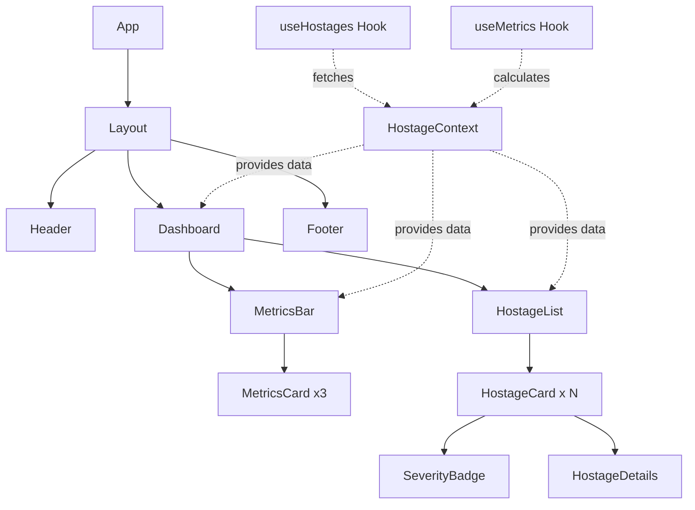

# Knowledge Hostage Detector - Architecture Plan

## Project Overview
A React dashboard application that displays undocumented business logic (knowledge hostages) found in codebases by IBM Bob. Built with Vite, React, TypeScript, and Tailwind CSS.

## Technology Stack
- **Framework**: React 18+ with TypeScript
- **Build Tool**: Vite
- **Styling**: Tailwind CSS
- **State Management**: React Context API (with hooks)
- **Data**: Mock data initially, API-ready architecture

---

## Project Structure

```
khd-dashboard/
├── public/
│   └── vite.svg
├── src/
│   ├── assets/
│   │   └── images/
│   ├── components/
│   │   ├── layout/
│   │   │   ├── Header.tsx
│   │   │   ├── Footer.tsx
│   │   │   └── Layout.tsx
│   │   ├── dashboard/
│   │   │   ├── Dashboard.tsx
│   │   │   ├── MetricsBar.tsx
│   │   │   └── MetricsCard.tsx
│   │   ├── hostages/
│   │   │   ├── HostageList.tsx
│   │   │   ├── HostageCard.tsx
│   │   │   ├── SeverityBadge.tsx
│   │   │   └── HostageDetails.tsx
│   │   └── common/
│   │       ├── Button.tsx
│   │       ├── Card.tsx
│   │       ├── Badge.tsx
│   │       └── LoadingSpinner.tsx
│   ├── context/
│   │   └── HostageContext.tsx
│   ├── hooks/
│   │   ├── useHostages.ts
│   │   └── useMetrics.ts
│   ├── types/
│   │   ├── hostage.types.ts
│   │   └── metrics.types.ts
│   ├── data/
│   │   └── mockHostages.ts
│   ├── utils/
│   │   ├── severityHelpers.ts
│   │   └── formatters.ts
│   ├── services/
│   │   └── api.service.ts (prepared for future API)
│   ├── styles/
│   │   └── index.css
│   ├── App.tsx
│   ├── main.tsx
│   └── vite-env.d.ts
├── index.html
├── package.json
├── tsconfig.json
├── tsconfig.node.json
├── vite.config.ts
├── tailwind.config.js
├── postcss.config.js
└── README.md
```

---

## Component Hierarchy

```
App
└── Layout
    ├── Header
    ├── Dashboard
    │   ├── MetricsBar
    │   │   ├── MetricsCard (Hostages Found)
    │   │   ├── MetricsCard (Critical Count)
    │   │   └── MetricsCard (Docs Generated)
    │   └── HostageList
    │       └── HostageCard (multiple)
    │           ├── SeverityBadge
    │           └── HostageDetails (expandable)
    └── Footer
```

---

## Data Models

### Hostage Interface
```typescript
interface Hostage {
  id: string;
  severity: 'critical' | 'high' | 'medium' | 'low';
  filePath: string;
  lineNumber?: number;
  explanation: string;
  recommendedAction: string;
  codeSnippet?: string;
  detectedAt: Date;
  category?: string;
  tags?: string[];
}
```

### Metrics Interface
```typescript
interface Metrics {
  totalHostages: number;
  criticalCount: number;
  docsGenerated: number;
  severityBreakdown: {
    critical: number;
    high: number;
    medium: number;
    low: number;
  };
}
```

---

## Component Responsibilities

### Layout Components

#### `Layout.tsx`
- Main application wrapper
- Provides consistent page structure
- Manages responsive layout

#### `Header.tsx`
- Application title and branding
- Navigation (if needed)
- Potential filters/search bar

#### `Footer.tsx`
- Copyright information
- Links to documentation
- Version information

### Dashboard Components

#### `Dashboard.tsx`
- Main container for dashboard content
- Orchestrates MetricsBar and HostageList
- Manages overall dashboard state

#### `MetricsBar.tsx`
- Container for metric cards
- Responsive grid layout
- Displays summary statistics

#### `MetricsCard.tsx`
- Reusable card for individual metrics
- Props: title, value, icon, trend
- Styled with Tailwind for consistency

### Hostage Components

#### `HostageList.tsx`
- Container for all hostage cards
- Handles filtering and sorting
- Manages list state
- Empty state handling

#### `HostageCard.tsx`
- Individual hostage display
- Expandable/collapsible functionality
- Shows summary view by default
- Expands to show full details

#### `SeverityBadge.tsx`
- Visual indicator of severity level
- Color-coded (red=critical, orange=high, yellow=medium, blue=low)
- Reusable across components

#### `HostageDetails.tsx`
- Expanded view of hostage information
- Shows full explanation
- Displays code snippet (if available)
- Shows recommended action
- Copy-to-clipboard functionality

### Common Components

#### `Button.tsx`
- Reusable button component
- Variants: primary, secondary, danger
- Sizes: small, medium, large

#### `Card.tsx`
- Base card component
- Used by MetricsCard and HostageCard
- Consistent shadow and border styling

#### `Badge.tsx`
- Generic badge component
- Used by SeverityBadge and tags

#### `LoadingSpinner.tsx`
- Loading state indicator
- Used during data fetching

---

## State Management Strategy

### Context API Structure
```typescript
// HostageContext will provide:
- hostages: Hostage[]
- metrics: Metrics
- loading: boolean
- error: string | null
- expandedHostageId: string | null
- setExpandedHostageId: (id: string | null) => void
- filterBySeverity: (severity: string) => void
- sortHostages: (sortBy: string) => void
```

### Custom Hooks

#### `useHostages()`
- Fetches and manages hostage data
- Provides filtering and sorting logic
- Returns hostages array and loading state

#### `useMetrics()`
- Calculates metrics from hostage data
- Returns computed metrics object
- Updates when hostage data changes

---

## Styling Approach with Tailwind CSS

### Color Palette
```javascript
// tailwind.config.js theme extension
colors: {
  severity: {
    critical: '#DC2626',  // red-600
    high: '#EA580C',      // orange-600
    medium: '#CA8A04',    // yellow-600
    low: '#2563EB',       // blue-600
  },
  background: {
    primary: '#F9FAFB',   // gray-50
    secondary: '#FFFFFF',
  },
  text: {
    primary: '#111827',   // gray-900
    secondary: '#6B7280', // gray-500
  }
}
```

### Component Styling Patterns

#### Cards
- `bg-white rounded-lg shadow-md p-6 hover:shadow-lg transition-shadow`

#### Badges
- `inline-flex items-center px-3 py-1 rounded-full text-sm font-medium`

#### Buttons
- `px-4 py-2 rounded-md font-medium transition-colors focus:outline-none focus:ring-2`

#### Responsive Grid
- MetricsBar: `grid grid-cols-1 md:grid-cols-3 gap-4`
- HostageList: `space-y-4`

---

## Mock Data Structure

### Sample Mock Data
```typescript
const mockHostages: Hostage[] = [
  {
    id: '1',
    severity: 'critical',
    filePath: 'src/services/payment.service.ts',
    lineNumber: 145,
    explanation: 'Complex payment calculation logic with multiple edge cases is not documented. The formula handles discounts, taxes, and promotional codes but lacks any explanation of the business rules.',
    recommendedAction: 'Create comprehensive documentation explaining the payment calculation formula, including all edge cases and business rules. Add inline comments for complex conditions.',
    codeSnippet: 'const total = calculateWithDiscounts(base, promo) * (1 + taxRate);',
    detectedAt: new Date('2026-05-15'),
    category: 'Business Logic',
    tags: ['payment', 'calculation', 'critical-path']
  },
  // ... more hostages
];
```

---

## API Integration Preparation

### Service Layer Structure
```typescript
// api.service.ts
class ApiService {
  private baseUrl: string;
  
  async fetchHostages(): Promise<Hostage[]> {
    // Future API call
    // For now, returns mock data
  }
  
  async fetchMetrics(): Promise<Metrics> {
    // Future API call
  }
  
  async generateDocumentation(hostageId: string): Promise<void> {
    // Future API call
  }
}
```

### Environment Configuration
```typescript
// .env structure
VITE_API_BASE_URL=http://localhost:3000/api
VITE_API_TIMEOUT=5000
```

---

## Component Interaction Flow



---

## Key Features Implementation

### 1. Expandable Hostage Cards
- Click to expand/collapse
- Smooth transition animation
- Only one card expanded at a time (optional)
- Keyboard navigation support

### 2. Severity Filtering
- Filter buttons in header or sidebar
- Visual feedback for active filter
- Maintains filter state in context

### 3. Metrics Calculation
- Real-time calculation from hostage data
- Animated counters for visual appeal
- Percentage changes (if historical data available)

### 4. Responsive Design
- Mobile-first approach
- Breakpoints: sm (640px), md (768px), lg (1024px), xl (1280px)
- Stacked layout on mobile, grid on desktop

### 5. Accessibility
- ARIA labels for interactive elements
- Keyboard navigation
- Focus management
- Screen reader friendly

---

## Performance Considerations

### Optimization Strategies
1. **Lazy Loading**: Use React.lazy for route-based code splitting
2. **Memoization**: Use React.memo for HostageCard components
3. **Virtual Scrolling**: Consider react-window for large lists (100+ items)
4. **Debouncing**: For search/filter inputs
5. **Code Splitting**: Separate vendor and app bundles

### Bundle Size Targets
- Initial bundle: < 200KB (gzipped)
- Lazy-loaded chunks: < 50KB each
- Total app size: < 500KB

---

## Testing Strategy

### Unit Tests
- Component rendering tests
- Hook logic tests
- Utility function tests

### Integration Tests
- User interaction flows
- Context provider behavior
- Filter and sort functionality

### E2E Tests (Future)
- Complete user journeys
- API integration tests

---

## Development Workflow

### Phase 1: Setup
1. Initialize Vite + React + TypeScript project
2. Configure Tailwind CSS
3. Set up project structure
4. Create type definitions

### Phase 2: Core Components
1. Build Layout components
2. Implement Dashboard container
3. Create MetricsBar and MetricsCard
4. Build HostageList and HostageCard

### Phase 3: State Management
1. Implement HostageContext
2. Create custom hooks
3. Connect components to context

### Phase 4: Mock Data & Polish
1. Create comprehensive mock data
2. Implement filtering and sorting
3. Add animations and transitions
4. Ensure responsive design

### Phase 5: API Preparation
1. Create API service layer
2. Add environment configuration
3. Implement error handling
4. Add loading states

---

## Future Enhancements

### Potential Features
- Search functionality across hostages
- Export to PDF/CSV
- Dark mode toggle
- Historical trend charts
- Bulk actions (mark as resolved, generate docs)
- Integration with IBM Bob API
- Real-time updates via WebSocket
- User authentication and permissions
- Custom severity thresholds
- Code snippet syntax highlighting

---

## Dependencies

### Core Dependencies
```json
{
  "react": "^18.2.0",
  "react-dom": "^18.2.0"
}
```

### Dev Dependencies
```json
{
  "@types/react": "^18.2.0",
  "@types/react-dom": "^18.2.0",
  "@vitejs/plugin-react": "^4.0.0",
  "typescript": "^5.0.0",
  "vite": "^4.3.0",
  "tailwindcss": "^3.3.0",
  "postcss": "^8.4.0",
  "autoprefixer": "^10.4.0"
}
```

### Optional Dependencies (Future)
- `axios` or `fetch` wrapper for API calls
- `date-fns` for date formatting
- `react-icons` for icon library
- `framer-motion` for advanced animations
- `react-syntax-highlighter` for code snippets

---

## Conclusion

This architecture provides a solid foundation for the Knowledge Hostage Detector dashboard with:
- Clear separation of concerns
- Scalable component structure
- Type-safe TypeScript implementation
- Modern React patterns (hooks, context)
- Responsive, accessible UI with Tailwind CSS
- Easy transition from mock data to API integration

The modular design allows for incremental development and easy maintenance as the application grows.